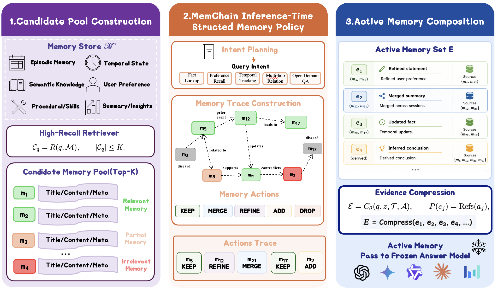

<h1 align="center">MemChain</h1>

<p align="center">
  <b>Learning Interpretable Memory Traces for Memory-Augmented LLM Agents</b>
</p>

<p align="center">
  Query-guided active-memory construction for long-dialogue agents.
</p>

<p align="center">
  
</p>

MemChain builds an interpretable memory trace from a user question and a
candidate memory pool, then composes compact active memories for a frozen answer
model. The goal is to make memory use explicit, grounded, and controllable
instead of passing raw retrieved memories directly to the answer model.

## Core Pipeline

MemChain follows this read-time pipeline:

1. Build provenance-preserving candidate memories from long dialogue history.
2. Infer the question intent and retrieve a bounded candidate memory pool.
3. Generate a structured memory trace with:
   - `intent_plan`
   - `memory_actions`
   - `memory_chain`
   - `active_memories`
4. Feed only `question + active_memories` to the answer model.

The memory-pool builder is answer-blind: it uses the question and dialogue
provenance, not the gold answer.

## Code Layout

```text
memchain/
  data/benchmarks/base.py        # normalized dialogue/session/QA dataclasses
  memory_pool/intent_guided.py   # answer-blind candidate memory pool
  schema.py                      # MemChain data schema
  framework.py                   # framework wrapper and active-memory composer
  prompts.py                     # policy and teacher prompts
  policy_io.py                   # policy JSON parsing and SFT row export
  reward.py                      # active-memory reward utility
  metrics.py                     # trace and active-memory metrics
  llm/                           # optional OpenAI-compatible clients
scripts/
  build_memory_pool.py           # build candidate pools from normalized JSONL
  run_heuristic_policy.py        # deterministic policy sanity check
tests/
  test_core.py
```

## Training

The intended training setup is H200 eight-card training.

In our experiments, MemChain policy training uses an SFT-to-RL workflow on
8 x H200 GPUs. The released code keeps the method-facing modules and reward
utilities clean; dataset paths, checkpoints, private endpoints, and cluster
launch scripts are intentionally not included.

## Install

```bash
pip install -e ".[dev]"
```

Optional dense retrieval:

```bash
pip install -e ".[dense]"
```

## Data Interface

Input data should be normalized as dialogues with sessions and QA pairs. The
core dataclasses are in `memchain/data/benchmarks/base.py`.

Each policy input uses:

- `question`
- `candidate_memories`
- optional `metadata`

Each policy output uses:

- `intent_plan`
- `memory_actions`
- `memory_chain`
- `active_memories`

## Scope

This repository only contains MemChain core code. It does not include
third-party comparison code, benchmark raw data, trained checkpoints, evaluation
outputs, paper draft folders, private API keys, private endpoints, or
machine-specific paths.

## License

MIT.
